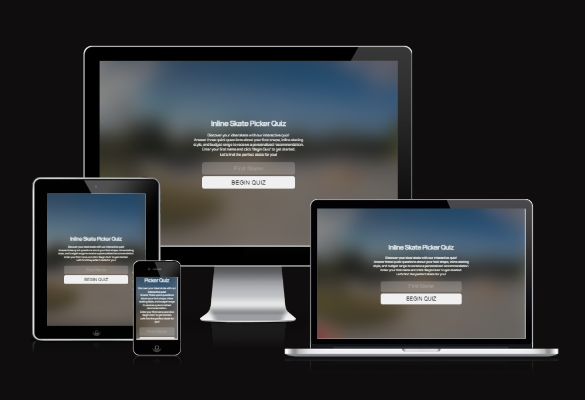

# Inline Skate Picker

This questionaire was designed to help users find an inline skate by answering three short questions and has been designed with a range of screen sizes in mind.

[View the Live project here](https://thomasballardci.github.io/M2-Skate-Selection-Quiz/)

## Table of Contents
1. [User Experience](#user-experience)
2. [Design](#design)
3. [Features](#features)
4. [Accessibility](#accessibility)
5. [Technologies Used](#technologies-used)
6. [Deployment and Local Development](#deployment-&-local-development)
7. [Testing](#testing)
8. [Credits](#credits)

## User Experience

### Initial Discussion

Since the Covid-19 Pandemic Inline skating has seen a boom of new and returning people coming to the sport. The current state of the market makes it hard for anyone new or returning to find a skate that is right for them, The Inline Skate Picker questionaire is a tool to help those find a good quality skate for a users individual needs more easily.

### Key information for the site

* Explanation of the questionaire and it's purpose
* The questionaire itself
* Inline Skate Recomendation

## User Stories

#### Client Goals

* To easily and quickly get an idea of the type of skate they require
* To be able to view and use the site on a range of devices

#### First Time Visitor Goals

* To be able to take the questionaire on a range of devices
* To understand how the questionaire works
* To recieve a Inline Skate recomendation to help the user choose what product to buy

##### Returning Visitor Goals

* To be able to take the questionaire again if users Inline Skate needs change

## Design

## Early Design Phases

The design was created as desktop first with a mindset for ease of conversion to mobile and tablet devices. 

[The inspiration from Apple TV app's  "Logout" screen](assets/images/readme/appletvlogout.jpg) utilising a clean and clear aesthetic to minimise clutter on the page and help the user focus on the questionaire itself.

Starting out with a basic wireframe layout design created in AdobeXD I then researched "Glassmorphism" to create the background art style to be similar to the effect of the Apple TV App.

I then found and picked the "Manrope font". This font again is similar to the Apple font and is clean clear and modern to match the overall asethetic of the site.

### Wireframes

#### Questionaire 
