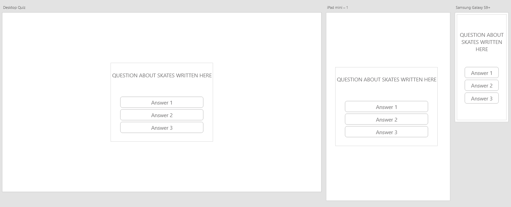
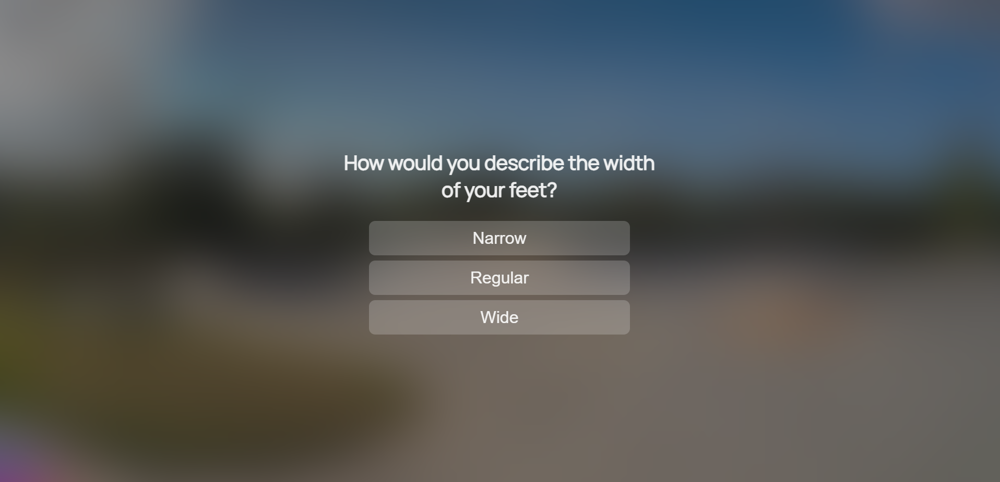

# Inline Skate Picker

This questionnaire was designed to help users find an inline skate by answering three short questions and has been designed with a range of screen sizes in mind.

[View the Live project here](https://thomasballardci.github.io/M2-Skate-Selection-Quiz/)

## Table of Contents
1. [User Experience](#user-experience)
2. [Features](#features)
3. [Design](#design)
4. [Technologies Used](#technologies-used)
5. [Deployment and Local Development](#deployment-&-local-development)
6. [Testing](#testing)
7. [Credits](#credits)

## User Experience

### Initial Discussion

Since the Covid-19 pandemic, inline skating has seen a boom of new and returning individuals taking up the sport. The current state of the market makes it challenging for newcomers or those returning to find the skate that suits them best. The Inline Skate Picker questionnaire is a tool designed to assist users in finding a high-quality skate that meets their individual needs more easily.

### Key information for the site

* Explanation of the questionnaire and its purpose.
* The questionnaire itself.
* Inline Skate Recommendation.

### User Stories

#### Client Goals

* To easily and quickly get an idea of the type of skate they require.
* To be able to view and use the site on a range of devices.

#### First Time Visitor Goals

* To be able to take the questionnaire on a range of devices.
* To understand how the questionnaire works.
* To receive an inline skate recommendation to help the user choose which product to buy.

##### Returning Visitor Goals

* To be able to take the questionnaire again if users' inline skate needs change.

## Features

### Existing Features

- __Name Input Field__

  - The name input field allows the user to input their name to be used on the results page for a personalised feel to the recommendations. Utilising a grey accent colour and highlighting white when selected allows the user to know they have selected the input field and to type their name in.

- __Landing/Welcome Page__

  - The Welcome page is there to show the user the title of the questionnaire, how many questions they will be answering, what the questionnaire is for, and how to begin.

- __Question pages__

  - The Question pages are designed to allow the user to clearly see the question being asked at the top, along with clear, large buttons to be selected for the users' response. When the user hovers over or selects the buttons, they highlight in white to clearly show the user what their selection will be, and then log the response.

- __Results Page__

  - The Results page has a clear, large title of the skate being recommended to the user based on the user's selections to the three previous questions. On this page, there is a personalised description of the skates, utilizing the user's name they input into the name field, as well as a clear image of the skate in question.

### Future Features

- __Email Form and Emailing of Results__

  - Given more time or as an update to the questionnaire, I feel taking the user's email address on submission and using it alongside a service like EmailJS to send the user the skate recommendation they receive on the results tab would be a welcome addition.

- __Back Buttons__

  - The addition of a back button on the questions, although I feel it is not "needed", would make for a good feature if the questionnaire was extended to include more detailed questions, allowing the user to change responses before generating a result.

## Design

### Initial Concept/Inspiration

The design was created as desktop-first with a mindset for ease of conversion to mobile and tablet devices.

[The inspiration from Apple TV app's  "Logout" screen](documentation/supp-images/appletvlogout.jpg) utilises a clean and clear aesthetic to minimise clutter on the page and help the user focus on the questionnaire itself.

Starting out with a basic wireframe layout design created in Adobe XD, I then researched "Glassmorphism" to create the background art style to be similar to the effect of the Apple TV app.

### Colour Scheme
The neutral colour scheme of whites, blacks, and greys was chosen to help with visual clarity while maintaining a clean and modern aesthetic.

### Typography
["Manrope"](https://fonts.google.com/specimen/Manrope?query=manrope) This font is similar to the Apple font and is clean, clear, and modern to match the overall aesthetic of the site.

### Background Image
The background image was generated using Adobe FireFly AI generation tool, prompting it to generate a concrete skatepark with a blue cloudy sky, trees in the background, and grass in the foreground. This was chosen to create a light and bright feel for the glassmorphism effect while maintaining the theme of inline skating.

### Wireframes

#### Questionnaire 

#### Results

#### Welcome

### Finalised Design

Working on the main questionnaire itself first from a design perspective allowed me to more easily transition the design philosophy over to the results and welcome pages.

#### Questionnaire

#### Results

#### Welcome

## Technologies Used

### Languages Used

- [HTML5](https://en.wikipedia.org/wiki/HTML5)
- [CSS3](https://en.wikipedia.org/wiki/Cascading_Style_Sheets)
- [Java Script](https://en.wikipedia.org/wiki/JavaScript)
- [Flexbox](https://developer.mozilla.org/en-US/docs/Learn/CSS/CSS_layout/Flexbox)

### Frameworks, Libraries & Programs Used

- [Google Fonts:](https://www.fonts.google.com/) Used to import the 'Manrope' font into the style.css file, which is used on all pages of the project.
- [Favicon.io](https://favicon.io/) Used to generate a favicon for the site and placed into the head of index.html.
- [VS Code](https://code.visualstudio.com/) Used to write the website code.
- [GitHub:](https://www.github.com/) Used as the repository for the project's code after being pushed from VSCode.
- [Adobe XD](https://www.adobe.com/creativecloud.html) Used to create the wireframes during the design process.
- [Adobe Photoshop](https://www.adobe.com/creativecloud.html) Used to create the background image and resize images of the skates.

## Deployment & Local Development

### Deployment

This project was deployed to GitHub Pages using the following steps:

1. Log into GitHub and locate the [GitHub Repository](https://github.com/ThomasBallardCI/M2-Skate-Selection-Quiz).
2. Click the settings button (above the "add file" button).
3. Click on "Pages" on the left-hand-side column.
4. Under "Source", click the dropdown called "Main", select folder ""/root" and click "save".
5. Refresh the page.
6. Click on the "Visit site" button at the top of the page.

### Local Deployment

#### How to Fork

To fork the Brain Worms repository:

1. Log in (or sign up) to GitHub.
2. Go to the repository for this project, at [GitHub Repository](https://github.com/ThomasBallardCI/M2-Skate-Selection-Quiz).
3. Click the Fork button in the top right corner.

#### How to Clone

To clone the Brain Worms repository:

1. Log in (or sign up) to GitHub.
2. Go to the repository for this project, at [GitHub Repository](https://github.com/ThomasBallardCI/M2-Skate-Selection-Quiz).
3. Above the list of files, click "Code".
4. Click "Open with GitHub Desktop" to clone and open the repository with GitHub Desktop.
5. Click "Choose..." and, using Windows Explorer, navigate to a local path where you want to clone the repository.
6. Click "Clone".

## Testing

Testing was an ongoing process as I built out the questionnaire, utilizing Chrome Developer Tools with console logging to ensure I was getting the required responses from the code as it was written.
There are two types of testing methods available: 'Manual' and 'Automated.' Both have been used in some form throughout the creation of the website questionnaire.

- __Manual Testing__ Is done by an individual to see if they can use the product in a way that creates, finds, and results in bugs, or not, to ensure it behaves correctly for the user when pushed live.

- __Automated Testing__ Is done by means of an automation framework or another tool or software suite to check for errors and bugs in code.

### Solved Bugs

- The hover effect was persistent across mobile and tablet devices and remained on the previously selected option during the questionnaire.

  - Fix: Used a media query (Pointer: fine) with the hover styling placed in to only target devices with an accurate pointer (like a mouse or stylus).

- The Name Input field allowed non-alphanumeric values.

  - Fix: Added code to JS to check that the user inputs only alphanumeric characters into the name field and, if not, alerts the user to provide a name containing them.

- The background blur was not applying on iPad OS/Safari browser.

  - Fix: Added a -webkit- CSS line to specifically target Safari and apply the blur.

### Known Bugs

- Firefox is not displaying the 'Manrope' font correctly and defaulting to sans-serif. Unsure of the reasoning and due to time constraints, could not find and implement a fix in time for submission.

### Validator Testing

#### [HTML Validator](https://validator.w3.org/)

  - __Result for Index.html (Whole site HTML)__

    Two warnings appear for the H1 and H2 headings. This is the result of those headings being populated by JS rather than HTML directly.
    

#### [CSS Validator](https://jigsaw.w3.org/css-validator/)

  - __Results for Style.css__

    

#### [Lighthouse Validaton](https://developer.chrome.com/docs/lighthouse/overview/)
  
  - __Desktop__

    

  - __Mobile__

    

#### [JSLint](https://jslint.com)

  - __Data.js__
    
    

  - __Sctipt.js__
    I added "document, alert, location" to the imported globals field due to them being provided by the browser environment. I also added "question and skateSuggest" as they are in the data.js file. I instructed it to allow whitespace for preference on how the code looks for readability, as well as length due to comments being longer than 80 characters.
    

### Manual Testing

All manual testing was carried out by myself and a few friends on various devices and browsers.

__Desktop__
- Chrome Version 114.0.5735.199 (Official Build) (64-bit)
- Firefox Version 115.0.2 (64-bit)
- Microsoft Edge4 Version 114.0.1823.82 (Official Build) (64-bit)

__Mobile__
- Samsung Galaxy S21+
- One UI Version 5.1/Android 13
- Chrome Version 114.0.5735.196

__Tablet__
- Apple Ipad Pro 13" 2021 - iPadOS Version 16.5.1
- Safari Version 16.0

### Test Cases and Results
  - Chrome Developer tools were used to fully test the site and its functionality throughout the development process, in combination with console logs as code was written, to ensure it was functioning correctly. The Chrome Developer tools were also used to test responsiveness for mobile and tablet device-specific styling before moving on to functionality testing on those devices physically.

#### Button
  - Testing of all buttons was carried out on all platforms to ensure they took you to the relevant next section, checked and logged the information required correctly or restarted the quiz entirely, with the questionnaire buttons being checked in all 27 possible combinations.

#### Input Field
  - Testing of the input field was done by passing it non-alphanumeric values at various stages of the 'Names' characters during input to ensure the code would trigger and send an alert to the user, notifying them that only alphanumeric characters are permitted.
  - Testing of the name being logged for use when the begin quiz button was pressed and the user had used only alphanumerical characters between 2 and 30 characters long was done via the Chrome DevTools and console logging the value pushed to the username variable.

## Credits

- [Locoskates.co.uk](https://Locoskates.co.uk) For the resized marketing images of the inline skates used.

- [Caniuse.com](https://caniuse.com/css-backdrop-filter) For CSS Backdrop filter compatibility with Safari.

- [StackOverFlow](https://stackoverflow.com/questions/73967974/disable-css-hover-when-touch-end-in-touch-device) To block the hover effects on mobile and tablet devices.

- [StackOverFlow](https://stackoverflow.com/questions/13183421/how-to-change-placeholder-color-on-focus) Changing placeholder font colour for input field.

- [Geeksforgeeks](https://www.geeksforgeeks.org/what-is-mouse-down-selector-in-css/) Creating a 'pressed in' effect on button press for desktop.

- [Plainenglish.io](https://javascript.plainenglish.io/how-to-get-the-id-of-the-clicked-element-in-the-javascript-click-handler-8ca398d848d6) For help with initially getting the ID of the question button selected by the logged-in user.

- [W3Schools]( https://www.w3schools.com/css/css3_flexbox.asp) For help with Flexbox. 

- [W3Schools](https://www.w3schools.com/tags/att_input_type_submit.asp) Help with submit button.

- [W3Schools](https://www.w3schools.com/css/css_form.asp) Text area styling for user name input field 

- [W3Schools](https://www.w3schools.com/jsref/met_win_alert.asp) Alerting user to incorrect name input.

- [Flexiple.com](https://flexiple.com/javascript/javascript-capitalize-first-letter/) Forcing user input to be uppercase on the first letter, regardless of the user's input when called on the results page.

- [Shecodes.io](https://www.shecodes.io/athena/8931-creating-a-string-with-variables-in-javascript) Help with stringing together username and results information on the results page.

- [educba](https://www.educba.com/clear-cache-javascript/) Help with clearing the username and stored results upon restart after clearing the cache.

Massive thanks to my tutor, Elaine Roche, for helping with suggestions for the code for the next question function to work correctly and checking user input is alphanumeric, as well as all the other support and brainstorming on ideas.

Massive thanks to my September 2022 Cohort group for helping with testing and peer reviewing my code

