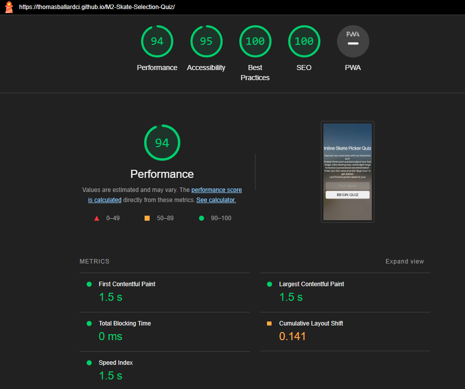

# Inline Skate Picker

This questionaire was designed to help users find an inline skate by answering three short questions and has been designed with a range of screen sizes in mind.

[View the Live project here](https://thomasballardci.github.io/M2-Skate-Selection-Quiz/)

## Table of Contents
1. [User Experience](#user-experience)
2. [Features](#features)
3. [Design](#design)
4. [Technologies Used](#technologies-used)
5. [Deployment and Local Development](#deployment-&-local-development)
6. [Testing](#testing)
7. [Credits](#credits)

## User Experience

### Initial Discussion

Since the Covid-19 Pandemic Inline skating has seen a boom of new and returning people coming to the sport. The current state of the market makes it hard for anyone new or returning to find a skate that is right for them, The Inline Skate Picker questionaire is a tool to help those find a good quality skate for a users individual needs more easily.

### Key information for the site

* Explanation of the questionaire and it's purpose
* The questionaire itself
* Inline Skate Recomendation

### User Stories

#### Client Goals

* To easily and quickly get an idea of the type of skate they require
* To be able to view and use the site on a range of devices

#### First Time Visitor Goals

* To be able to take the questionaire on a range of devices
* To understand how the questionaire works
* To recieve a Inline Skate recomendation to help the user choose what product to buy

##### Returning Visitor Goals

* To be able to take the questionaire again if users Inline Skate needs change

## Features

### Existing Features

- __Name Input Field__

  - The name input field allows the user to input their name for to be used on the results page for a personalised feel to the recommendations. Utilising a grey accent colour and highlighting white when selected alows the user to know they have selected the input field and to type their name in.

- __Landing/Welcome Page__

  - The Welcome page is there to show the user the title of the questionaire, How many questions they will be answering, What the questionaire is for and how to begin.

- __Question pages__

  - The Question pages are designed to allow the user to clearly see the question being asked at the top along with clear large buttons to be selected for the users response, When user hovers over or selects the buttons they highlight white to clearly show the user what thier selection will be and then logs the response.

- __Results Page__

  - The Results page have a clear large title of the skate being recommended to the user based on the users selection to the three previous questions. On this page is a personalised description of the skates utilising the user name they input into the name field as well as a clear image of the skate in question.

### Future Features

- __Email Form and Emailing of Results__

  - Given more time or as an update to the Questionaire I feel taking the users email address on submission and using it alongside a service like EmailJS to send the user the skate recommendation they recieve on the results tab would be a welcome addition.

- __Back Buttons__

  - The addition of a back button on the questions although I feel is not "needed" would make for a good feature if the questionaire was extended to more detailed questions to allow the user to change responses before generating a result.

## Design

### Initial Concept/Inspiration

The design was created as desktop first with a mindset for ease of conversion to mobile and tablet devices. 

[The inspiration from Apple TV app's  "Logout" screen](documentation/supp-images/appletvlogout.jpg) utilising a clean and clear aesthetic to minimise clutter on the page and help the user focus on the questionaire itself.

Starting out with a basic wireframe layout design created in AdobeXD I then researched "Glassmorphism" to create the background art style to be similar to the effect of the Apple TV App.

### Colour Scheme
The neutral colour scheme of whites, blacks and greys was chosen to help with visual clarity whilst maintaining a clean and modern aesthetic.

### Typography
"Manrope font". This font is similar to the Apple font and is clean clear and modern to match the overall asethetic of the site.

### Background Image
The background image was generated using Adobe FireFly AI generation tool. Promting it to generate a concrete skatepark with blue cloudy sky, trees in background and grass in the forground. This was chosen to create a light and bright feel for the glassmorphism effect whilst maintaining the theme of inline skating.

### Wireframes

#### Questionaire 

#### Results

#### Welcome

### Finalised Design

Working on the main questionaire itself first from a design perspective allowed me to more easily transition the design philosphy over to the results and welcome pages.

#### Questionaire

#### Results

#### Welcome

## Technologies Used

### Languages Used

- [HTML5](https://en.wikipedia.org/wiki/HTML5)
- [CSS3](https://en.wikipedia.org/wiki/Cascading_Style_Sheets)
- [Java Script](https://en.wikipedia.org/wiki/JavaScript)
- [Flexbox](https://developer.mozilla.org/en-US/docs/Learn/CSS/CSS_layout/Flexbox)

### Frameworks, Libraries & Programs Used

- [Google Fonts:](https://www.fonts.google.com/) was used to import the 'Manrope' font into the style.css file which is used on all pages of the project.
- [Favicon.io](https://favicon.io/) Was used to generate a favicon for the site and placed into the head of index.html.
- [VS Code](https://code.visualstudio.com/) Was used to write the website code
- [GitHub:](https://www.github.com/) is used as the repository for the project's code after being pushed from Gitpod.
- [Adobe XD](https://www.adobe.com/creativecloud.html) was used to create the wireframes during the design process.
- [Adobe Photoshop](https://www.adobe.com/creativecloud.html) was used to create the background image and resize images of the skates.

## Deployment & Local Development

### Deployment

This project was deployed to GitHub Pages using the following steps:

1. Log into GitHub and locate the [GitHub Repository](https://github.com/ThomasBallardCI/M2-Skate-Selection-Quiz).
2. Click the settings button (above the "add file" button).
3. Click on "Pages" on the left-hand-side column.
4. Under "Source", click the dropdown called "Main", select folder ""/root" and click "save".
5. Refresh the page.
6. Click on the "Visit site" button at the top of the page.

### Local Deployment

#### How to Fork

To fork the Brain Worms repository:

1. Log in (or sign up) to GitHub.
2. Go to the repository for this project, at [GitHub Repository](https://github.com/ThomasBallardCI/M2-Skate-Selection-Quiz).
3. Click the Fork button in the top right corner.

#### How to Clone

To clone the Brain Worms repository:

1. Log in (or sign up) to GitHub.
2. Go to the repository for this project, at [GitHub Repository](https://github.com/ThomasBallardCI/M2-Skate-Selection-Quiz).
3. Above the list of files, click "Code".
4. Click "Open with GitHub Desktop" to clone and open the repository with GitHub Desktop.
5. Click "Choose..." and, using Windows Explorer, navigate to a local path where you want to clone the repository.
6. Click "Clone".

## Testing

Testing was ongoing process as I built out the Questionaire utilising Chrome developer tools with console logging to ensure I was getting the responses required from the code as is was written.
There is two types of testing methods available "Manual" and "Automated" both have been used in some form throughout the creating of the website questionaire.
- __Manual Testing__ is done by a individual to see if they can use the product in a way that creates, finds and results in bugs or not to ensure it behaves correctly for the user when pushed live.

- __Automated Testing__ is done by means of an automation framework or another tool or software suite to check for errors and bugs in code.

### Validator Testing

#### [HTML Validator](https://validator.w3.org/)

  - __Result for Index.html (Whole site HTML)__

    Two Warnings appear for the h1 and h2 headings this is the result of those headings being populated by JS rather than HTML directly.
    

#### [CSS Validator](https://jigsaw.w3.org/css-validator/)

  - __Results for Style.css__

    

#### [Lighthouse Validaton](https://developer.chrome.com/docs/lighthouse/overview/)
  
  - __Desktop__

    

  - __Mobile__

    

#### [JSLint](https://jslint.com)

  - __Data.js__
    The two warnings have been rectified.
    

  - __Sctipt.js__
    I added "document, alert, location" to the imported globals field due to them being being provided by the browswer enviroment, I also added "question and skateSuggest" as they are in the data.js file. I told it to allow white space for preference on how the code looks for readability as well as long due to comment being longer than 80 characters.
    

### Manual Testing

All manual testing was carried out by myself and a few friends on various devices and browsers these include.

__Desktop__
- Chrome Version 114.0.5735.199 (Official Build) (64-bit)
- Firefox Version 115.0.2 (64-bit)
- Microsoft Edge4 Version 114.0.1823.82 (Official Build) (64-bit)

__Mobile__
- Samsung Galaxy S21+
- One UI Version 5.1/Android 13
- Chrome Version 114.0.5735.196

__Tablet__
- Apple Ipad Pro 13" 2021 - iPadOS Version 16.5.1
- Safari Version 16.0

